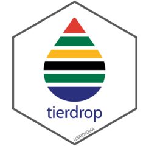

# tierdrop 

TierDrop is a package to process, validate, and consolidate MER data from 2 primary data sources (TIER data from the National Department of Health (NDoH) and non-TIER data reported from implementing partners) for import to DATIM for USAID South Africa.

This package will allow users to tidy and process data from NDoH into a DATIM import file, consolidate TIER and non-TIER files, and run verification checks to build the Data Quality Reporting Trackers (DQRT).
